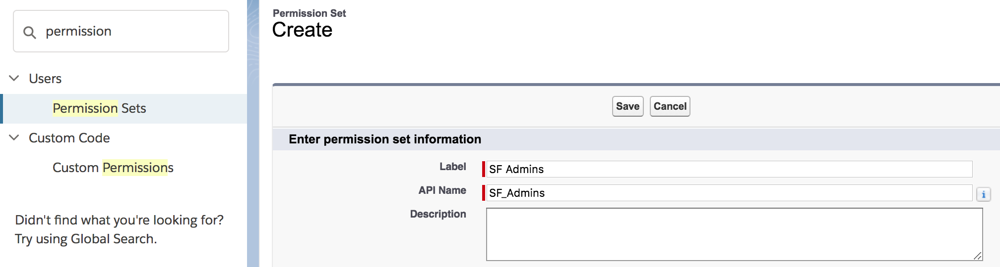

# Overview

In Classic, you have the ability to use QuickLinks - a configurable set of links for people to see in the Sidebar.

What options do you have available in Lightning Experience?

**Please note: Please see the [Install](#install) section for how to install.**

Sample code is available as an [installation url](#install-via-url) or [Salesforce DX](#installing-via-the-salesforce-cli) or [MetaData/Ant](./mdapi)

# Demo

This project contains a sample component that slightly enhances the standard 'QuickLink' behavior, and very easily shows some of the power available with Lightning Experience.

In this example, we create a custom object (called Quick Link) that list out according to the Lightning Design System.

Each are avaialble through Declarative means, and can be modified by anyone with the 'QuickLinkAdmin' permission set. (QuickLinkUsers should only be able to use them)

The QuickLinks shown are based on the QuickLink records, each specifying the target, icon and how it behaves.

They are also optionally tied to a custom permission, so Administrators have complete control over whom can see which tile.

In this case, the Demo Setup initially assigns you as a 'Quick Link Admin'. So you have the 'QuickLinksAdmin' custom permission, and can thus see the 'Admin Only Link'.

Switching your user to only the 'Quick Link User' permission set, would not see this link, because it does not have that Custom Permission.

# To Use

Tiles available for everyone, simply require a new `Quick Link` record.

**1.** Create a new Quick Link record

<table>
	<tr>
		<th>Name</th>
		<th>Description</th>
		<th>Example</th>
	</tr>
	<tr>
		<td>Quick Link Name</td>
		<td>Name visible in the list</td>
		<td>Account Link</td>
	</tr>
	<tr>
		<td>External Id</td>
		<td>External Id to use for loading / updates with external systems</td>
		<td>Account_Link</td>
	</tr>
	<tr>
		<td>Type</td>
		<td>VisualForce | URL | Record</td>
		<td>URL</td>
	</tr>
	<tr>
		<td>Description</td>
		<td>Description of your Quick Link (for posterity)</td>
		<td>...</td>
	</tr>
	<tr>
		<td>Target</td>
		<td>VisualForce Page API / URL / SF Id</td>
		<td>https://www.google.com</td>
	</tr>
	<tr>
		<td>Icon Name</td>
		<td>Name of the Icon from <a href='https://lightningdesignsystem.com/icons/'>the Lightning Design System</a></td>
		<td>custom</td>
	</tr>
	<tr>
		<td>Icon Group</td>
		<td>Icon Group from <a href='https://lightningdesignsystem.com/icons/'>the Lightning Design System</a></td>
		<td>standard</td>
	</tr>
	<tr>
		<td>Optional - Permission</td>
		<td>Custom Permission that a user must have to see this QuickLink</td>
		<td>QuickLinkAdmin</td>
	</tr>
</table>

### Private QuickLinks

The `Permission` value indicates which CustomPermission that people must have to see this QuickLink.

If it is blank - then it is visible to all people.

Otherwise, we recommend using PermissionSets to grant out the QuickLink.

**1.** Create the Custom Permission

**Please note: the Name/API Name is what is used in the `Permission` field of the QuickLink**

**2.** Create a PermissionSet

**3.** Assign the Custom Permission to the PermissionSet

(Search for 'Custom Permission' in Permission Set > Edit > Assign your new Custom Permission)

**4.** Assign users to that PermissionSet.

(Manage Assignments > Add Assignments > Select Users > Assign)

Now - any user that accesses the QuickLinks that have that PermissionSet will see that QuickLink.

# TLDR How

* We create a custom Lightning Component to expose those QuickLinks
* And provide it on custom Home Page Layouts / Utility Bars or even separate pages.

As it is a lightning component, we can customize how it behaves within the App Builder / extend it as desired / or have complete control over where it is placed.

# Custom Permissions How

The majority of the magic happens within the [ltng_QuickLinksCmp_C.cls](dx/force-app/main/default/classes/ltng_QuickLinksCmp_C.cls)

(for the list of all variables, please see the Controller code. Abbreviated here for readability).

First, lets get all the QuickLinks, in order or Sort Priority.
(Making sure that those without priority are listed last)
		
		//-- determine all quicklinks and sort them by the permission required to see them.
		ltng_QuickLink__c[] allQuickLinks = [ select id, name, Description__c, ExternalId__c, IconGroup__c, IconName__c, Type__c, Target__c, Permission__c, PreferredSortIndex__c, LastModifiedDate
			from ltng_QuickLink__c
			order by PreferredSortIndex__c NULLS LAST, name
		];
		
		for( ltng_QuickLink__c quickLink : allQuickLinks ){
			if( String.isEmpty( quickLink.Permission__c )){
				results.add( quickLink );
			} else {
				if( !quickLinksByPermission.containsKey( quickLink.Permission__c )){
					quickLinksByPermission.put( quickLink.Permission__c, new ltng_QuickLink__c[]{} );
				}
				quickLinksByPermission.get( quickLink.Permission__c ).add( quickLink );
			}
		}
		

We now know all the quicklinks that require permissions (and need further attention - to see if the user can see them)

QuickLinks without any CustomPermission assignment are shown to everyone.

Lets get a list of the Custom Permissions (known by their Salesforce ID)

		allQuickLinkPermissions = quickLinksByPermission.keySet();
		
		//-- create a translation for all custom permission DeveloperNames to their IDs
		for( CustomPermission perm: [
			SELECT Id, DeveloperName FROM CustomPermission WHERE DeveloperName in :allQuickLinkPermissions
		]){
			customPermissions.put( perm.Id, perm.DeveloperName );
		}
		
We now know the Custom Permissions mapped to their Salesforce ID.

(We limit this to only those CustomPermissions used within QuickLinks - to be efficient).

We now need to collect all the PermissionSets that contain those CustomPermissions.
		
		//System.debug( 'customPermissionsMap:' + customPermissions );
		//-- collect all permission sets by custom permission developer name
		String permissionName;
		for( SetupEntityAccess access: [
			SELECT SetupEntityId, ParentId FROM SetupEntityAccess WHERE SetupEntityId in (
				SELECT Id FROM CustomPermission WHERE DeveloperName in :allQuickLinkPermissions
			)
		]){
			if( !permissionSetPermissions.containsKey( access.ParentId )){
				permissionSetPermissions.put( access.ParentId, new String[]{} );
			}
			permissionName = customPermissions.get( access.SetupEntityId );
			permissionSetPermissions.get( access.ParentId ).add( permissionName );
		}
		
We now have a list of all permissionSets with the custom permissions that they contain.
		
We need to determine all the PermissionSets that the user has, and therefore all the CustomPermissions the user has.

		Set<String> userCustomPermissions = new Set<String>();
		for( PermissionSetAssignment assignment: [
			SELECT PermissionSetId FROM PermissionSetAssignment where AssigneeId = :userId
		]){
			if( permissionSetPermissions.containsKey( assignment.PermissionSetId )){
				userCustomPermissions.addAll( permissionSetPermissions.get( assignment.PermissionSetId ) );
			}
		}
		
We now know all the custom permissions that the user belongs to.

We need to add all the quickLinks that are available for the current user, to the results.
		
		for( String userCustomPermission : userCustomPermissions ){
			results.addAll( quickLinksByPermission.get( userCustomPermission ));
		}
		
And finally return the results
		
		return( results );

---

# Install

There are three methods available for you to install this demo, so you can play around with it:

(Please note, all are intended as demonstrations and are not intended for deployment to Production as is)

* [Install via URL](#install-via-url)
* [Install Demo via Salesforce CLI](#install-via-salesforce-cli)
* [Install Demo via Ant/Metadata API](#install-via-metadata-api)

## Install via URL

This works very similar to an App Exchange install.

Please login to an available sandbox and click the link below.

[https://test.salesforce.com/packaging/installPackage.apexp?p0=04t6A000002ssf4QAA](https://test.salesforce.com/packaging/installPackage.apexp?p0=04t6A000002ssf4QAA)

(or simply navigate to `https://YOUR_SALESFORCE_INSTANCE/packaging/installPackage.apexp?p0=04t6A000002ssf4QAA`  
if you are already logged in)

It is recommended to install for Admins Only (but all options will work)

##### Run Demo Setup

Next, click on the 'dice' and open the 'URL Hack Demo' app.

and run `Setup` from the `URL Hack Demo Setup` tab.

This will then perform any additional setup (such as creating records, etc).

##### Run the Demos

Thats it, all information should be avaiable for running all demos now from the `URL Hack Bases` tab.

Feel free to create your own and to create children through the QuickActions, Lightning Actions or List View buttons.

See the [To Use](#to-use) section for more detail.

## Installing via the Salesforce CLI

This assumes you have already installed the [Salesforce CLI]() and [Connected the Salesforce CLI to your org](https://developer.salesforce.com/docs/atlas.en-us.sfdx_dev.meta/sfdx_dev/sfdx_dev_auth_web_flow.htm).

However, the Salesforce CLI can be used with any org and does not require Salesforce DX to be enabled. (Although enabling the DX / Dev Hub would give some great benefits, and would only require care of [certain object permissions: Scratch Org Info, ActiveScratchOrg, NamespaceRegistry](https://developer.salesforce.com/docs/atlas.en-us.sfdx_setup.meta/sfdx_setup/sfdx_setup_add_users.htm) - as they are not available in all orgs)

**1.** Run the following command:

	sfdx force:source:push -u [[orgAlias]] -w

**2.** Add the permission set to your user

	sfdx force:user:permset:assign -n QuickLinksAdmin -u [[orgAlias]]
	
**3.** Upload the data

	sfdx force:data:tree:import -f data/trees/ltng_QuickLink__c.json -u [[orgAlias]]
	
or optionally run the `Quick Link Setup` (available after you open the org)

	sfdx force:org:open -u [[orgAlias]]
	

Thats it, you can now open the `Quick Links Demo` to see those QuickLinks available.

	
